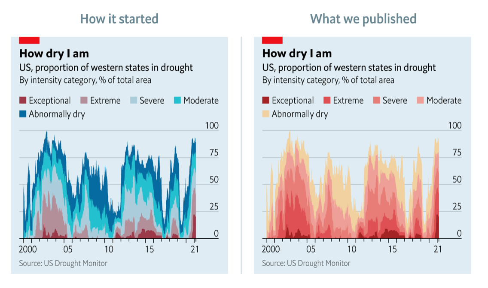

## 2021-07-20: US Droughts

----

**Lessons that I learned during this challenge:**

This week I reproduce the below plot ["How dry I am"](https://view.e.economist.com/?qs=e2eb491699083554e6e0165e2847c6ebb1f8701f81f48a77a213f54bb25691d58948226f18f5041b191897ec7e98e6462192c63afffc8fcb27220927072403ebf4a1d8b65776755bcddddcf91218183a) by The Economist. 



The primary lesson doing this plot was to rebuild the x-axis entirely (lesson 1-3).

1. **The first time I rebuild :hammer_and_wrench: an entire axis using `annotate()`: from the ticks to the labels.** The x-axis requires expansion of the plot's y-region; in this visualization, the y-limits are between [0, 100] (percentages), but I broadened from -10 to 100. This margin is reserved for displaying the x-axis within `theme()`.

   ```R
   # expand y-region of the plot
   scale_y_continuos(limits = c(-10, 100), ...)
   
   # remove the default x-axis
   theme(..., axis.text.x = element_blank(), ...)
   ```

2. **Make annotations ✍️ requires auxiliary datasets with the information**. I used one data frame for the x-axis labels and another for the x-axis ticks.

   ```R
   # tibble for x-axis text using with annotations()
   x_axis = tibble(
     x = c(
           lubridate::ym("2002/07"),
           lubridate::ym("2006/07"),
           lubridate::ym("2010/07"),
           lubridate::ym("2014/07"),
           lubridate::ym("2018/07"),
           lubridate::ym("2021/01")),
     y = -7,
     label = c("2002", "06", "10", "14", "18", "21")
   )
   
   # tibble for xticks using with geom_linerange()
   x_ticks = tibble(
               x = c(seq.Date(lubridate::ym("2002/01"), 
                              lubridate::ym("2021/01"), 
                                        by = "1 year"),
                               max(drought$valid_start)),
               ymax = 0,
               ymin = c(rep(c(4, 4, 2.3, 2.3), 4),  4, 4, 2.3, 4, 2.3) * -1)
   ```

3. **Use annotate() for axis-text and geom_linerange() for axis-ticks**. The lines for the axis can draw using geom_hline and geom_vline for x and y-axis, respectively.

   ```R
     annotate(geom = "text", x = x_axis$x, y = x_axis$y,
              label = x_axis$label, size = 3.7) +
     geom_linerange(data = x_ticks,
                    aes(x = x, ymin = ymin, ymax = ymax)) +
     geom_hline(aes(yintercept=0)) +
   ```

4. **Using legend within `theme()` to control the position and other visual aspects :eye:.** The arguments `legend.key.width` and `legend.key.height` for fine control of the size colours squares in the legend.

   ```R
      theme(..., 
   		     legend.position = "top",
       		 legend.justification = "left",
       	 	 legend.key.width = unit(0.3, "cm"),
          	 legend.key.height = unit(0.18, "cm"),
       		 legend.spacing.x = unit(0.2, "cm"),
       		 legend.margin = margin(5, .2, .2, .2),
            ...)
   ```

5. **Display the legends in different position and order using `guides(guide_legend())`** . The latter is without changing the visual order in the `geom_area` categories.

   ```R
   guides(fill = guide_legend(ncol = 4, byrow = TRUE, reverse = TRUE))
   ```

6. **Move the y-axis :straight_ruler: to the right position using `scale_y_continuous(position = "right")`**.

   

   

   

